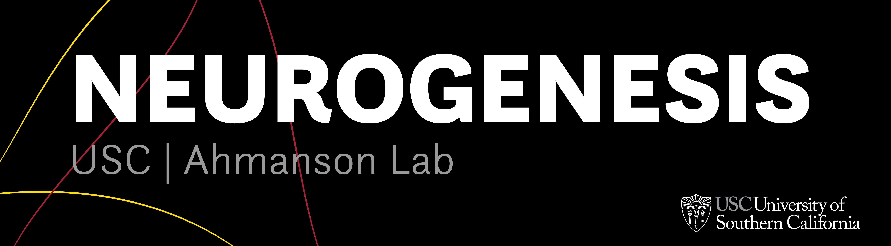

**Neurogenesis** is a working group at the USC Ahmanson Lab during the 2019-2020 academic year. We are developing generative artwork using the OpenBCI headset. 

# Packages
## Unity
*This package includes several ready-to-use inlets for OpenBCI data streams.*
   

### Inlets

#### How to Use (X)Inlet
    1. Make sure LSL4Unity is in your assets folder
    2. Make sure an LSL stream on the OpenBCI GUI is set to (X)
    3. Set '# Chan' to the correct number (5 for bands, 125 for FFT, 1 for focus)
    4. Drag this script onto the desired Unity object
    5. Set the correct stream name (e.g. obci_eeg1) in the Inspector
    6. Use (X)Inlet in other scripts applied to this object!
    
  **BandsInlet:** a double inlet stream for OpenBCI band data.

  **FFTInlet:** a float inlet stream for OpenBCI fast fourier transform (FFT) data.

  **FocusInlet:** an integer inlet stream for OpenBCI focus data.

### Example Use Cases
  **FocusForward:** increments the z-position when the user is "focused".

  **PrimitiveHeights:** controls the height of Unity primitives given the value of the applied inlet stream.

  **BasicFlowField:** creates a 3D flow field and particles whose movement are responsive to several inlet streams.

## Python
*This package includes a ready-to-use inlet for OpenBCI data streams.*

  **StreamFFT:** a basic script to import an OpenBCI LSL stream into Python.

